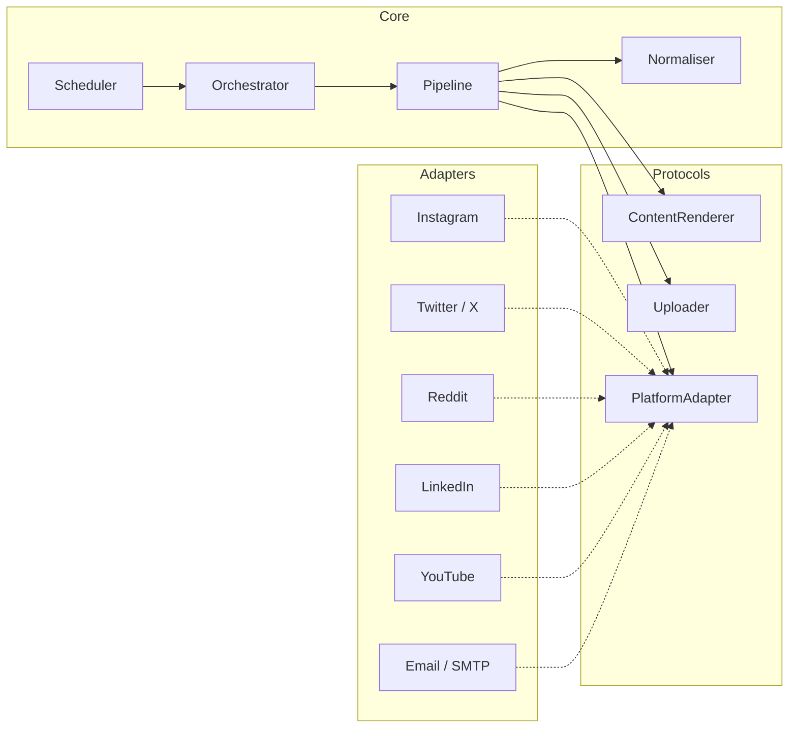

<h1 align="center">MarketMeNow</h1>

<p align="center">
  <em>The marketing intern that never sleeps.</em>
  <br /><br />
  <a href="https://github.com/thearnavrustagi/marketmenow/blob/main/LICENSE"></a>
  <a href="https://www.python.org/downloads/"></a>
  <a href="https://github.com/thearnavrustagi/marketmenow"></a>
</p>

<p align="center">
  Open-source framework that generates and publishes marketing content across 6 platforms from a single command.
</p>

---

> Marketing was eating 2+ hours/day as a solo founder. So I built myself an intern. After one week: **14k+ impressions, 700+ website visits, ~5 min/day of my time.** ([results on Gradeasy](https://gradeasy.com))

<br/>

<p align="center">
  <a href="https://www.youtube.com/shorts/e6ETkNYnAdQ">
    
  </a>
  <br />
  <em>Click to watch an AI-generated Instagram Reel</em>
</p>

<br/>

| Platform | Content | Generate | Publish | In-Context Learning |
|---|---|:---:|:---:|:---:|
| **Instagram** | Reels, Carousels | ✅ | ✅ | ✅ |
| **X / Twitter** | Replies, Threads | ✅ | ✅ | ✅ |
| **Reddit** | Comments | ✅ | 🚧 WIP | - |
| **LinkedIn** | Posts, Images, Videos, Docs | ✅ | 🚧 WIP | - |
| **YouTube** | Shorts | ✅ | ✅ | - |
| **Email** | Bulk outreach | ✅ | ✅ | - |

<br/>

## Features

<table>
<tr>
<td align="center" width="33%">
<h3>In-Context Learning</h3>
Learns from your top-performing posts. The more you post, the better it matches your voice.
</td>
<td align="center" width="33%">
<h3>Brand Templates</h3>
Figma MCP + YAML templates. Your fonts, colors, layout. AI fills the content.
</td>
<td align="center" width="33%">
<h3>Engagement Automation</h3>
Finds relevant conversations, writes contextual replies, posts with human-like timing.
</td>
</tr>
<tr>
<td align="center">
<h3>Email Batching</h3>
CSV in, 100 personalized emails out. Picks up where it left off.
</td>
<td align="center">
<h3>Real-Time Dashboard</h3>
Live progress, streaming logs, approve/reject per item. One click to publish all.
</td>
<td align="center">
<h3>Modular Adapters</h3>
Add a platform with zero changes to core. Ports-and-adapters architecture.
</td>
</tr>
</table>

<br/>

<p align="center">
  
</p>

<br/>

## Quick Start

```bash
git clone https://github.com/thearnavrustagi/marketmenow.git && cd marketmenow && bash setup.sh
```

Edit `.env` with your API keys, then:

```bash
uv run mmn-web          # Dashboard at http://localhost:8000
```

> **Requirements:** Python 3.12+, [uv](https://docs.astral.sh/uv/) (setup.sh installs it). Docker recommended for PostgreSQL. Node.js 18+ only if you want Instagram Reels.

<details>
<summary><strong>Manual setup</strong></summary>

```bash
git clone https://github.com/thearnavrustagi/marketmenow.git
cd marketmenow

uv sync
docker compose up -d
cp .env.example .env

uv run playwright install chromium
cd src/adapters/instagram/reels/remotion && npm install && cd -

uv run mmn-web
```

</details>

<details>
<summary><strong>Platform credentials</strong></summary>

You only need credentials for the platforms you use:

| Platform | What you need |
|---|---|
| Instagram | `INSTAGRAM_ACCESS_TOKEN`, `INSTAGRAM_BUSINESS_ACCOUNT_ID` |
| Twitter/X | `TWITTER_AUTH_TOKEN`, `TWITTER_CT0` (or `mmn twitter login`) |
| Reddit | `REDDIT_SESSION` cookie, `REDDIT_USERNAME` |
| LinkedIn | `LINKEDIN_ACCESS_TOKEN` (or `LINKEDIN_LI_AT` cookie) |
| YouTube | Google OAuth 2.0 (`mmn youtube auth`) |
| Email | `SMTP_HOST`, `SMTP_PORT`, `SMTP_USERNAME`, `SMTP_PASSWORD`, `SMTP_FROM` |
| AI (all) | `GOOGLE_APPLICATION_CREDENTIALS`, `VERTEX_AI_PROJECT` |

</details>

<details>
<summary><strong>CLI reference</strong></summary>

```bash
# Instagram
mmn reel create --publish
mmn carousel generate --publish

# Twitter/X
mmn twitter login
mmn twitter all
mmn twitter engage
mmn twitter reply -f replies.csv
mmn twitter thread --post

# Reddit
mmn reddit engage
mmn reddit reply -f comments.csv

# LinkedIn
mmn linkedin auth
mmn linkedin post --text "Hello!"

# YouTube
mmn youtube auth
mmn youtube upload video.mp4

# Email
mmn email send -f contacts.csv -t template.html -r 0-100
```

</details>

<details>
<summary><strong>Customizing for your brand</strong></summary>

All brand identity lives in YAML files, not code. Repurpose the entire tool for your product in under an hour.

**Prompts (text content: tweets, carousels, LinkedIn, Reddit, email):**

1. **Swap the brand (5 min):** Open `prompts/` and replace `Gradeasy` with your brand name, URL, and audience keywords.
2. **Tweak the voice (10 min):** Each prompt has a persona section. Edit the voice for each platform in `prompts/<platform>/`.
3. **Adjust topics (5 min):** Search for topic constraints and replace with your domain.
4. **Set mention rate:** Each prompt has a `MENTION STRATEGY` section controlling how often your brand appears.

Or use the **meta-prompt** in `prompts/prompt.md` to generate entire prompt YAML files with any AI chat.

**Reels (video content):**

The existing reels are purpose-built for Gradeasy's concept. For your product you'll want a completely different reel — different narrative, different scenes, different voice. The **reel template meta-prompt** in [`src/adapters/instagram/reels/templates/prompt.md`](src/adapters/instagram/reels/templates/prompt.md) lets you paste your brand details and reel concept into ChatGPT / Claude and get back both files you need:

1. A **template YAML** — the video structure (scenes, beats, transitions, pipeline)
2. A **companion prompt YAML** — the AI persona that writes the script

Drop them into `src/adapters/instagram/reels/templates/` and `prompts/instagram/`, then run `mmn reel create --template your_id`. Full schema reference, available scenes, transitions, and pipeline steps are all in that file.

</details>

<details>
<summary><strong>Architecture</strong></summary>

Ports-and-adapters design. The core engine knows nothing about any specific platform. Each adapter implements `PlatformAdapter`, `ContentRenderer`, and `Uploader` protocols.



**Pipeline:** Normalise -> Render -> Upload -> Publish

**Adding a platform:** Create `src/adapters/yourplatform/`, implement the protocols, register with `AdapterRegistry`. Zero changes to core.

</details>

## Roadmap

Checked items are shipped. Unchecked items are planned or in progress.

### Done

- [x] **6-platform content engine** — Instagram Reels & Carousels, Twitter replies & threads, Reddit comments, LinkedIn posts, YouTube Shorts, bulk email — generate and publish from one CLI or web dashboard
- [x] **In-context learning & brand templates** — learns from top-performing posts to match your voice; YAML-driven brand identity (prompts, visuals, mention strategy) with Figma MCP integration
- [x] **Ports-and-adapters core** — modular pipeline (normalise → render → upload → publish), campaign orchestrator, scheduler, and `AdapterRegistry` — add a platform with zero changes to core

### Up Next

- [ ] **Reddit & LinkedIn publish** — finish WIP uploaders for both platforms, full end-to-end tests
- [ ] **Personas** — bundle brand voice, visual identity, prompts, and platform credentials into switchable "personas" so you can manage multiple brands or collaborate with a team from one install
- [ ] **Twitter discovery & cold DM** — find Twitter accounts relevant to your brand, score them, and send personalized cold DMs at human-like pace
- [ ] **Pipelines & modularisation** — composable pipelines that chain the existing tools (discover → generate → review → publish) into reusable flows you define in YAML and execute with a single command

## Star History

<a href="https://www.star-history.com/?repos=thearnavrustagi%2Fmarketmenow&type=date&legend=top-left">
 <picture>
   <source media="(prefers-color-scheme: dark)" srcset="https://api.star-history.com/image?repos=thearnavrustagi/marketmenow&type=date&theme=dark&legend=top-left" />
   <source media="(prefers-color-scheme: light)" srcset="https://api.star-history.com/image?repos=thearnavrustagi/marketmenow&type=date&legend=top-left" />
   
 </picture>
</a>

## Contributing

See [CONTRIBUTING.md](CONTRIBUTING.md) for development setup, code style, and the PR process.

## License

[MIT](LICENSE)
