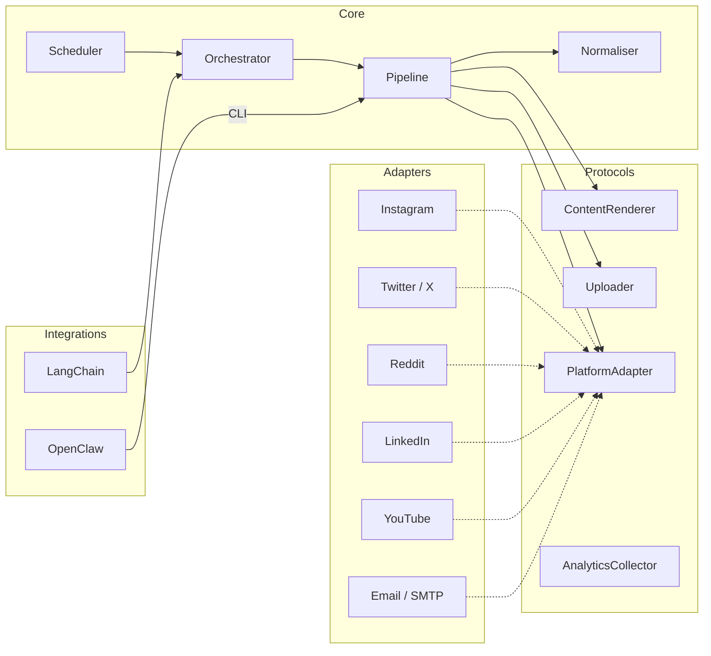

<p align="center">
  <br />
  <strong>MarketMeNow</strong>
  <br />
  <em>The marketing intern that never sleeps.</em>
  <br /><br />
  <a href="https://github.com/thearnavrustagi/marketmenow/blob/main/LICENSE"></a>
  <a href="https://www.python.org/downloads/"></a>
  <a href="https://github.com/thearnavrustagi/marketmenow"></a>
</p>

---

Open-source framework that generates, schedules, and publishes content across 7 platforms — from a single command. Define your brand once, review and approve, it does the rest.

| Platform | Content | Generate | Publish | In-Context Learning |
|---|---|:---:|:---:|:---:|
| **Instagram** | Reels, Carousels | :white_check_mark: | :white_check_mark: | :white_check_mark: |
| **X / Twitter** | Replies, Threads | :white_check_mark: | :white_check_mark: | :white_check_mark: |
| **Reddit** | Comments | :white_check_mark: | :white_check_mark: | — |
| **LinkedIn** | Posts, Images, Videos, Docs | :white_check_mark: | :white_check_mark: | — |
| **YouTube** | Shorts | :white_check_mark: | :white_check_mark: | — |
| **Email** | Bulk outreach | :white_check_mark: | :white_check_mark: | — |

> I was spending 2+ hours/day on marketing as a solo founder. After one week with MarketMeNow: **14k+ impressions, 700+ website visits, ~5 min/day of my time.** ([results on Gradeasy](https://gradeasy.com))

## Dashboard

MarketMeNow ships with a **real-time web dashboard** built on FastAPI + HTMX with WebSocket-powered progress streaming.

<p align="center">
  
</p>

**What you see:**
- Every content item across all platforms in one view, with status badges (Generating, Pending Review, Queued, Posting, Posted, Failed)
- **Live progress bars** with phase indicators (Discovery → Generation → Posting) and countdown timers for rate-limited waits
- **Streaming logs** — every line of CLI output pushed to your browser in real-time via WebSocket
- **"Generate & Publish All"** button — one click creates content for all 7 platforms and publishes them in parallel
- Approve, reject, or regenerate individual pieces before they go live

## Key Features

### In-Context Learning

MarketMeNow scrapes your own profile to find your top-performing posts and replies (by likes, retweets, and engagement). These winning examples are automatically injected as few-shot examples into the AI prompt when generating new content. The more you post, the better it gets at matching your voice and what resonates with your audience.

### Brand Identity Through Templates

AI-generated content has a reputation problem — it all looks the same. MarketMeNow solves this with **Figma MCP integration** and **YAML-based templates** that lock in your brand's visual identity, fonts, color palette, and layout. The AI fills in the content; your templates control how it looks. The result: you're pushing AI-assisted content, but it's *your* AI-assisted content — consistent, on-brand, and recognizable. This matters especially for solo founders and small teams who can't afford to have every post look like it came from a different person.

### Engagement Automation

Twitter and Reddit adapters don't just post — they discover relevant conversations in your niche, generate contextual replies, and post them with human-like timing (5–10 minute randomized delays between actions). Rate limits, cooldowns, and anti-detection measures are handled automatically.

### Email Batching

Drop a CSV of contacts into `vault/teachers.csv` and MarketMeNow will send the next 100 emails every time you hit "Generate & Publish All." It tracks its position with a simple offset file, so it picks up where it left off. Templates support Jinja2 variables from any CSV column.

## Quick Start

### One-Line Setup

```bash
git clone https://github.com/thearnavrustagi/marketmenow.git && cd marketmenow && bash setup.sh
```

This will: check Python 3.12+, install [uv](https://docs.astral.sh/uv/) if missing, install all dependencies, set up Playwright browsers, create `.env` from the template, and optionally start PostgreSQL via Docker Compose.

After setup, edit `.env` with your API keys and run:

```bash
uv run mmn-web
```

Open [http://localhost:8000](http://localhost:8000). Click **"Generate & Publish All"** to kick off the full pipeline.

### Prerequisites

| Requirement | Required? | Notes |
|---|---|---|
| Python 3.12+ | Yes | Core runtime |
| [uv](https://docs.astral.sh/uv/) | Yes | `setup.sh` installs it automatically |
| Docker | Recommended | For PostgreSQL — or bring your own DB |
| Node.js 18+ | Only for Reels | Remotion video composition |

### Manual Setup (Step by Step)

<details>
<summary>Click to expand</summary>

```bash
git clone https://github.com/thearnavrustagi/marketmenow.git
cd marketmenow

# Install Python deps
uv sync

# Start PostgreSQL (or set your own DB URL in .env)
docker compose up -d

# Create and edit your env file
cp .env.example .env
# → Edit .env with your API keys

# Install Playwright browsers (for Twitter/Reddit automation)
uv run playwright install chromium

# (Optional) Install Remotion for Instagram Reels
cd src/adapters/instagram/reels/remotion && npm install && cd -

# Start the dashboard
uv run mmn-web
```

</details>

### Platform Credentials

You only need credentials for the platforms you want to use:

| Platform | What you need |
|---|---|
| Instagram | `INSTAGRAM_ACCESS_TOKEN`, `INSTAGRAM_BUSINESS_ACCOUNT_ID` |
| Twitter/X | `TWITTER_AUTH_TOKEN`, `TWITTER_CT0` (or run `mmn twitter login`) |
| Reddit | `REDDIT_SESSION` cookie, `REDDIT_USERNAME` |
| LinkedIn | `LINKEDIN_ACCESS_TOKEN` (or `LINKEDIN_LI_AT` cookie) |
| YouTube | Google OAuth 2.0 (run `mmn youtube auth`) |
| Email | `SMTP_HOST`, `SMTP_PORT`, `SMTP_USERNAME`, `SMTP_PASSWORD`, `SMTP_FROM` |
| AI (all) | `GOOGLE_APPLICATION_CREDENTIALS`, `VERTEX_AI_PROJECT` |

### Or Use the CLI

```bash
# Instagram
mmn reel create --output-dir output/    # Generate a reel
mmn reel create --publish               # Generate and publish
mmn carousel generate --publish         # AI carousel

# Twitter/X
mmn twitter login                       # One-time browser login
mmn twitter all                         # Full pipeline: replies + thread
mmn twitter engage                      # Generate replies (CSV)
mmn twitter reply -f replies.csv        # Post from CSV
mmn twitter thread --post               # Generate and post a thread

# Reddit
mmn reddit engage                       # Discover + generate comments
mmn reddit reply -f comments.csv        # Post from reviewed CSV

# LinkedIn
mmn linkedin auth                       # One-time OAuth
mmn linkedin post --text "Hello!"       # Publish a post

# YouTube
mmn youtube auth                        # One-time OAuth
mmn youtube upload video.mp4            # Upload a Short

# Email
mmn email send -f contacts.csv -t template.html -r 0-100
```

## Examples

### Instagram Reel

<p align="center">
  <a href="https://www.youtube.com/shorts/e6ETkNYnAdQ">
    
  </a>
  <br />
  <em>▶ Click to watch on YouTube</em>
</p>

AI-generated script → ElevenLabs TTS → Remotion video composition with template-driven branding. Published via `mmn reel create --publish`.

### Instagram Carousel

<p align="center">
  &nbsp;&nbsp;
  
</p>

Generated with Gemini + Imagen, or exported from Figma designs via the Figma MCP integration.

### Twitter Thread

```
Tweet 1 (Hook): "Most teachers spend 5+ hours a week grading. Here's what happens
when you let AI do it instead:"

Tweet 2: "1. Upload the assignment photo..."
Tweet 3: "2. AI reads the handwriting..."
...
Tweet 6 (CTA): "Try it free → gradeasy.com"
```

AI-generated with topic-aware hooks, numbered listicle format, and a CTA. Published with human-like timing via stealth browser automation.

### Reddit Comment

> Discovered a post in r/Teachers asking about grading tools → Generated a helpful, non-promotional comment with genuine advice → Posted with randomized 2–5 minute delays between comments.

### Email Outreach

Jinja2 HTML templates with per-recipient personalization (`{{ first_name }}`). Optional Gemini-powered paraphrasing so no two emails read identically.

## Architecture



**Ports-and-adapters design** — the core engine knows nothing about Instagram, Twitter, or any specific platform. Each adapter implements `PlatformAdapter`, `ContentRenderer`, and `Uploader` protocols. Adding a new platform requires zero changes to `core/`, `models/`, or `ports/`.

### Content Pipeline

Every publish goes through the same pipeline:

1. **Normalise** — Convert any content model into a platform-agnostic envelope
2. **Render** — Transform into platform-specific form (caption limits, hashtag formatting, etc.)
3. **Upload** — Push media assets and get back opaque handles
4. **Publish** — Make the final API call

### Content Modalities

| Modality | Model | Used By |
|---|---|---|
| `reel` / `video` | `Reel` | Instagram, YouTube |
| `carousel` / `image` | `Carousel` | Instagram |
| `thread` | `Thread` | Twitter/X |
| `reply` | `Reply` | Twitter/X, Reddit |
| `text_post` | `TextPost` | LinkedIn |
| `direct_message` | `DirectMessage` | Email |

## Adding a Platform

1. Create `src/adapters/yourplatform/`
2. Implement `PlatformAdapter`, `ContentRenderer`, `Uploader` protocols
3. Bundle into `PlatformBundle` and register with `AdapterRegistry`
4. Optionally add CLI commands via Typer

No changes to core. See the [Instagram](src/adapters/instagram/), [Twitter](src/adapters/twitter/), [Reddit](src/adapters/reddit/), [LinkedIn](src/adapters/linkedin/), or [Email](src/adapters/email/) adapters for examples.

## Contributing

See [CONTRIBUTING.md](CONTRIBUTING.md) for development setup, code style (Python 3.12+, Pydantic frozen models, Protocol interfaces, async-first), and the PR process.

## License

[MIT](LICENSE)
