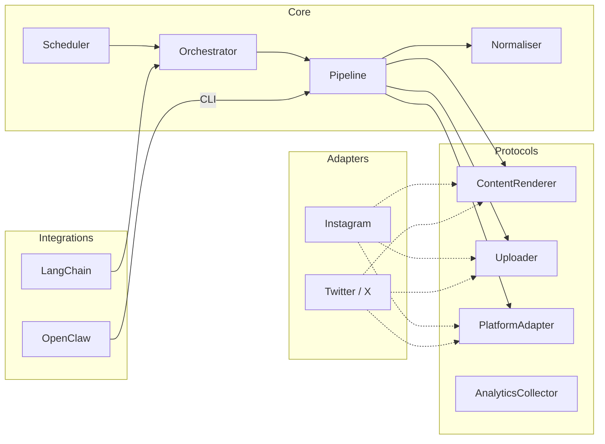
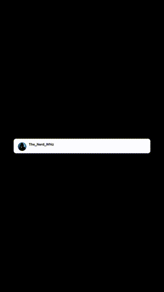

<p align="center">
  <br />
  <strong>MarketMeNow</strong>
  <br />
  <em>Open-source agentic marketing framework</em>
  <br /><br />
  <a href="https://github.com/Wayground/marketmenow/blob/main/LICENSE"></a>
  <a href="https://www.python.org/downloads/"></a>
  <a href="https://github.com/Wayground/marketmenow"></a>
</p>

---

MarketMeNow is a **modular, async-first** Python framework for automating content creation, publishing, and engagement across social media platforms. It uses a **hexagonal (ports-and-adapters) architecture** so the core engine is completely platform-agnostic — you add platform support by implementing a small set of Protocol interfaces and registering them with the adapter registry.

It ships with first-class integrations for **LangChain** and **[OpenClaw](https://openclaw.dev)**, so you can drop it straight into any AI agent workflow — use natural language through an OpenClaw channel (Slack, Discord, Telegram) or wire it into a LangChain agent graph.

## Platform Support

| Platform | Status | Modalities | Highlights |
|---|---|---|---|
| **Instagram** | :white_check_mark: Implemented | Reels, Carousels | AI reel generation (Gemini + Remotion + TTS), Figma-to-carousel export, AI carousel generation (Gemini + Imagen) |
| **X / Twitter** | :white_check_mark: Implemented | Replies, Threads | Browser-based engagement automation, AI reply generation (Gemini), stealth Playwright session management |

> **Want to add a platform?** See [Contributing](#contributing) — the ports-and-adapters design makes it straightforward.

## Architecture



### Content Pipeline

Every publish goes through the same pipeline regardless of platform:

1. **Normalise** — The `ContentNormaliser` converts any content model (`Reel`, `Carousel`, `Thread`, `DirectMessage`, `Reply`) into a platform-agnostic `NormalisedContent` envelope.
2. **Render** — The platform's `ContentRenderer` transforms the envelope into platform-specific form (caption limits, aspect ratio adjustments, hashtag formatting, etc.).
3. **Upload** — The platform's `Uploader` pushes media assets to their destination and returns opaque `MediaRef` handles.
4. **Publish / Send** — The platform's `PlatformAdapter` makes the final API call to publish the post or send the DM.

### Content Modalities

| Modality | Model | Description |
|---|---|---|
| `reel` | `Reel` | Short-form video with caption, hashtags, optional thumbnail |
| `carousel` | `Carousel` | Multi-slide media post with per-slide captions |
| `thread` | `Thread` | Ordered list of text + media entries |
| `direct_message` | `DirectMessage` | Private message with recipients, subject, body, attachments |
| `reply` | `Reply` | Reply to an existing post on any platform |

## Examples

### Instagram Reel

<p align="center">
  
</p>

<sub>Generated with <code>mmn instagram reel create</code> — AI script, TTS, and Remotion video composition.</sub>

### Instagram Carousel

<p align="center">
  &nbsp;&nbsp;
  
</p>

<sub>Generated with <code>mmn instagram carousel generate</code> — Gemini + Imagen pipeline.</sub>

## Quick Start

### Prerequisites

- Python 3.12+
- [uv](https://docs.astral.sh/uv/) (recommended) or pip
- Node.js 18+ (only needed for Instagram Reels — Remotion video composition)

### Installation

```bash
git clone https://github.com/Wayground/marketmenow.git
cd marketmenow
uv sync
```

For LangChain integration:

```bash
uv sync --extra langchain
```

### Environment Setup

Copy the example environment variables into a `.env` file:

```bash
# Instagram
INSTAGRAM_ACCESS_TOKEN=your_token
INSTAGRAM_BUSINESS_ACCOUNT_ID=your_account_id
FIGMA_API_TOKEN=your_figma_token

# Twitter/X
TWITTER_USERNAME=your_username
TWITTER_PASSWORD=your_password

# AI / TTS
GOOGLE_APPLICATION_CREDENTIALS=vertex.json
VERTEX_AI_PROJECT=your_project_id
ELEVENLABS_API_KEY=your_key
OPENAI_API_KEY=your_key
```

### First Run

```bash
# See the welcome banner and available commands
mmn

# List supported platforms
mmn platforms

# Generate an Instagram reel
mmn instagram reel create \
  --assignment ./my_image.png \
  --template can_ai_grade_this

# Run Twitter/X engagement
mmn twitter login          # one-time interactive login
mmn twitter engage --dry-run   # preview without posting
```

## CLI Reference

MarketMeNow provides a unified `mmn` CLI with platform sub-commands:

```
mmn                             Show welcome banner
mmn --help                      Full help menu
mmn version                     Show version
mmn platforms                   List platforms & modalities
```

### Instagram

```
mmn instagram reel create       Generate a reel from template + image
mmn instagram reel preview      Open Remotion Studio for live preview
mmn instagram reel list-templates   List available YAML reel templates
mmn instagram reel validate     Validate a template file
mmn instagram carousel export   Export Figma frames as carousel
mmn instagram carousel generate Generate an AI carousel (Gemini + Imagen)
```

### Twitter / X

```
mmn twitter login               Interactive browser login (saves session)
mmn twitter engage              Discover posts + generate & post replies
mmn twitter discover            Preview discovered posts
mmn twitter test-reply <URL>    Generate a reply for a specific tweet
```

## Integrations

### LangChain

MarketMeNow ships LangChain-compatible tools so any agent can publish content or run campaigns:

```python
from marketmenow import AdapterRegistry
from marketmenow.integrations.langchain import get_tools

from adapters.instagram import create_instagram_bundle
from adapters.twitter import create_twitter_bundle

registry = AdapterRegistry()
registry.register(create_instagram_bundle())
registry.register(create_twitter_bundle())

tools = get_tools(registry)

# Use with any LangChain agent
from langchain_openai import ChatOpenAI
from langchain.agents import create_tool_calling_agent, AgentExecutor

llm = ChatOpenAI(model="gpt-4o")
agent = create_tool_calling_agent(llm, tools, prompt=...)
executor = AgentExecutor(agent=agent, tools=tools)
executor.invoke({"input": "Create a carousel about Python tips and publish it to Instagram"})
```

**Available tools:**
- `mmn_list_platforms` — discover available platforms and modalities
- `mmn_publish` — publish a single piece of content to any platform
- `mmn_run_campaign` — run a multi-platform campaign

### OpenClaw

MarketMeNow includes a native OpenClaw plugin. Install it from the repo root:

```bash
openclaw plugins install ./
```

This registers MarketMeNow tools in the OpenClaw Gateway, letting you use natural language to trigger content creation and publishing through any OpenClaw channel (Slack, Discord, Telegram, etc.).

See [`openclaw/`](openclaw/) for the plugin manifest and tool schemas.

## Programmatic Usage

### Publishing a Single Reel

```python
import asyncio
from marketmenow import AdapterRegistry, ContentPipeline, Reel, MediaAsset
from adapters.instagram import create_instagram_bundle

registry = AdapterRegistry()
registry.register(create_instagram_bundle())

pipeline = ContentPipeline(registry)

reel = Reel(
    video=MediaAsset(uri="./output/my_reel.mp4", mime_type="video/mp4"),
    caption="Check this out!",
    hashtags=["python", "coding"],
)

result = asyncio.run(pipeline.execute(reel, "instagram"))
print(result)
```

### Running a Multi-Platform Campaign

```python
import asyncio
from marketmenow import (
    Campaign, CampaignTarget, ContentModality,
    Orchestrator, AdapterRegistry, Carousel, CarouselSlide, MediaAsset,
)
from adapters.instagram import create_instagram_bundle

registry = AdapterRegistry()
registry.register(create_instagram_bundle())

orchestrator = Orchestrator(registry)

campaign = Campaign(
    name="Product Launch",
    content=Carousel(
        slides=[
            CarouselSlide(
                media=MediaAsset(uri="./slide1.png", mime_type="image/png"),
                caption="Slide 1",
            ),
            CarouselSlide(
                media=MediaAsset(uri="./slide2.png", mime_type="image/png"),
                caption="Slide 2",
            ),
        ],
        caption="Our new product is here!",
        hashtags=["launch", "product"],
    ),
    targets=[
        CampaignTarget(platform="instagram", modality=ContentModality.CAROUSEL),
    ],
)

result = asyncio.run(orchestrator.run_campaign(campaign))
```

## Adding a Platform

The hexagonal architecture makes adding a new platform adapter straightforward. No changes to `core/`, `models/`, or `ports/` are required.

1. **Create an adapter package** under `src/adapters/yourplatform/`.

2. **Implement the protocols** defined in `src/marketmenow/ports/`:

   | Protocol | What it does |
   |---|---|
   | `PlatformAdapter` | `platform_name`, `supported_modalities()`, `authenticate()`, `publish()`, `send_dm()` |
   | `ContentRenderer` | Transform `NormalisedContent` into platform-specific form |
   | `Uploader` | Upload media assets and return `MediaRef` handles |
   | `AnalyticsCollector` *(optional)* | Collect post-publish engagement metrics |

3. **Bundle and register:**

   ```python
   from marketmenow.registry import PlatformBundle, AdapterRegistry

   bundle = PlatformBundle(
       adapter=YourPlatformAdapter(),
       renderer=YourPlatformRenderer(),
       uploader=YourPlatformUploader(),
   )

   registry = AdapterRegistry()
   registry.register(bundle)
   ```

4. **Add CLI commands** (optional) as a Typer app and wire them into the main `mmn` CLI.

For a complete example, see the [Instagram adapter](src/adapters/instagram/) or the [Twitter adapter](src/adapters/twitter/).

## Configuration

All settings are loaded from environment variables (with `.env` file support via `pydantic-settings`). Each adapter has its own settings class:

| Setting | Description |
|---|---|
| `INSTAGRAM_ACCESS_TOKEN` | Meta Graph API access token |
| `INSTAGRAM_BUSINESS_ACCOUNT_ID` | Instagram Business Account ID |
| `FIGMA_API_TOKEN` | Figma API token (for carousel export) |
| `TWITTER_USERNAME` | Twitter/X login username |
| `TWITTER_PASSWORD` | Twitter/X login password |
| `GOOGLE_APPLICATION_CREDENTIALS` | Path to Vertex AI / Gemini service account JSON |
| `VERTEX_AI_PROJECT` | Google Cloud project ID |
| `VERTEX_AI_LOCATION` | Google Cloud region (default: `us-central1`) |
| `ELEVENLABS_API_KEY` | ElevenLabs TTS API key |
| `OPENAI_API_KEY` | OpenAI API key (for TTS or LLM calls) |
| `TTS_PROVIDER` | TTS backend: `elevenlabs`, `openai`, `local`, or `kokoro` |

## Contributing

We welcome contributions! See [CONTRIBUTING.md](CONTRIBUTING.md) for:

- Development setup
- Code style guidelines (Python 3.12+, Pydantic frozen models, Protocol interfaces, async-first)
- Architecture rules (no platform imports in core)
- Step-by-step guide for adding platforms and modalities
- PR process

## License

[MIT](LICENSE) — use it however you want.
