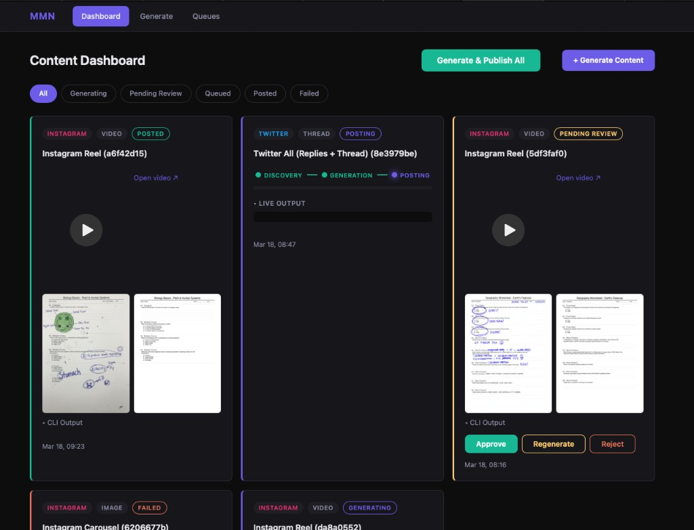
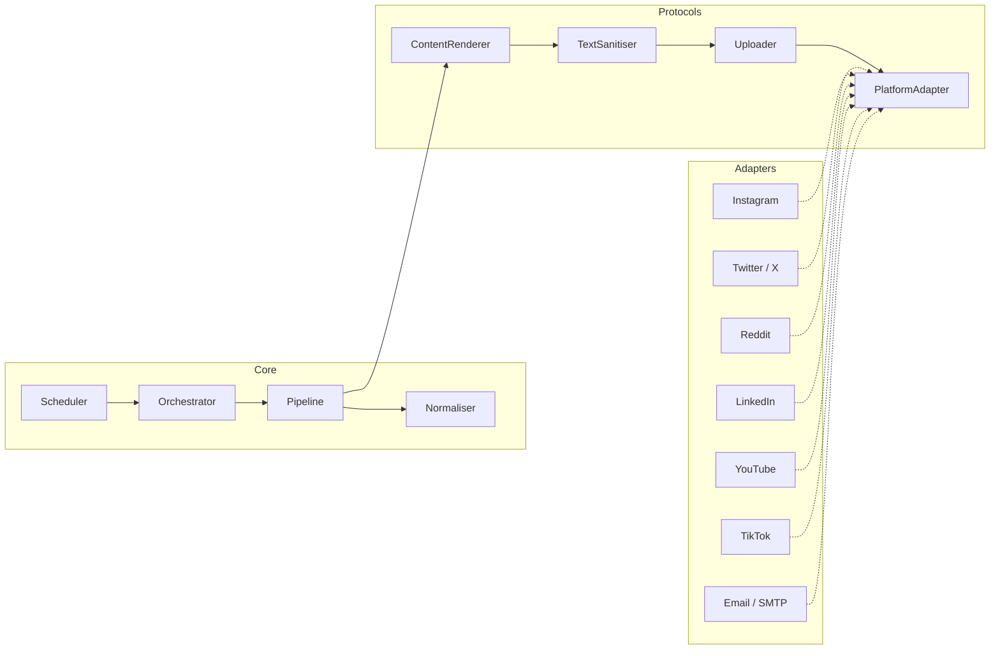

<h1 align="center">MarketMeNow</h1>

<p align="center">
  <em>The marketing intern that never sleeps.</em>
  <br /><br />
  <a href="https://github.com/thearnavrustagi/marketmenow/blob/main/LICENSE"></a>
  <a href="https://www.python.org/downloads/"></a>
  <a href="https://github.com/thearnavrustagi/marketmenow"></a>
</p>

<p align="center">
  Open-source framework that generates and publishes marketing content across 7 platforms from a single command.
</p>

---

> Marketing was eating 2+ hours/day as a solo founder. So I built an intern that never sleeps.

<br/>

<p align="center">
  <a href="https://www.youtube.com/shorts/e6ETkNYnAdQ">
    
  </a>
  <br />
  <em>Click to watch an AI-generated Instagram Reel</em>
</p>

<br/>

| Platform | Content | Generate | Publish | In-Context Learning |
|---|---|:---:|:---:|:---:|
| **Instagram** | Reels, Carousels | ✅ | ✅ | ✅ |
| **X / Twitter** | Replies, Threads | ✅ | ✅ | ✅ |
| **Reddit** | Comments, Posts | ✅ | ✅ | - |
| **LinkedIn** | Posts, Images, Videos, Docs | ✅ | 🚧 WIP | - |
| **YouTube** | Shorts | ✅ | ✅ | - |
| **TikTok** | Videos | ✅ | ✅ | - |
| **Email** | Bulk outreach | ✅ | ✅ | - |

<br/>

## Features

<table>
<tr>
<td align="center" width="33%">
<h3>In-Context Learning</h3>
Learns from your top-performing posts. The more you post, the better it matches your voice.
</td>
<td align="center" width="33%">
<h3>Brand Templates</h3>
Figma MCP + YAML templates. Your fonts, colors, layout. AI fills the content.
</td>
<td align="center" width="33%">
<h3>Engagement Automation</h3>
Finds relevant conversations, writes contextual replies, posts with human-like timing.
</td>
</tr>
<tr>
<td align="center">
<h3>Email Batching</h3>
CSV in, 100 personalized emails out. Picks up where it left off.
</td>
<td align="center">
<h3>Real-Time Dashboard</h3>
Live progress, streaming logs, approve/reject per item. One click to publish all.
</td>
<td align="center">
<h3>Modular Adapters</h3>
Add a platform with zero changes to core. Ports-and-adapters architecture.
</td>
</tr>
<tr>
<td align="center">
<h3>Auto-Heal</h3>
One command runs lint, format, and tests - then hands failures to the Cursor agent to fix automatically.
</td>
<td align="center">
<h3>Content Capsules</h3>
Every generated reel, carousel, and thread is packaged into a self-contained capsule. Cross-post to any platform with one command — no re-generation needed.
</td>
<td align="center">
</td>
</tr>
</table>

<br/>

<p align="center">
  
</p>

<br/>

## Quick Start

```bash
git clone https://github.com/thearnavrustagi/marketmenow.git && cd marketmenow && bash setup.sh
```

Edit `.env` with your API keys, then:

```bash
uv run mmn-web          # Dashboard at http://localhost:8000
```

> **Requirements:** Python 3.12+, [uv](https://docs.astral.sh/uv/) (setup.sh installs it). Docker recommended for PostgreSQL. Node.js 18+ only if you want Instagram Reels.

<details>
<summary><strong>Manual setup</strong></summary>

```bash
git clone https://github.com/thearnavrustagi/marketmenow.git
cd marketmenow

uv sync
docker compose up -d
cp .env.example .env

uv run pre-commit install --hook-type pre-push   # tests + lint before every push
uv run playwright install chromium
cd src/adapters/instagram/reels/remotion && npm install && cd -

uv run mmn-web
```

</details>

<details>
<summary><strong>Platform credentials</strong></summary>

You only need credentials for the platforms you use:

| Platform | What you need |
|---|---|
| Instagram | `INSTAGRAM_ACCESS_TOKEN`, `INSTAGRAM_BUSINESS_ACCOUNT_ID` |
| Facebook | `FACEBOOK_C_USER`, `FACEBOOK_XS` (optionally `FACEBOOK_PAGE_IDS`) |
| Twitter/X | `TWITTER_AUTH_TOKEN`, `TWITTER_CT0` (or `mmn twitter login`) |
| Reddit | `REDDIT_SESSION` cookie, `REDDIT_USERNAME` |
| LinkedIn | `LINKEDIN_ACCESS_TOKEN` (or `LINKEDIN_LI_AT` cookie) |
| YouTube | Google OAuth 2.0 (`mmn auth youtube`) |
| TikTok | `TIKTOK_SESSION_ID` cookie (or OAuth 2.0 via `mmn auth tiktok`) |
| Email | `SMTP_HOST`, `SMTP_PORT`, `SMTP_USERNAME`, `SMTP_PASSWORD`, `SMTP_FROM` |
| AI (all) | AI Studio: `GEMINI_API_KEY` (or `GOOGLE_API_KEY`) **or** Vertex: `GOOGLE_APPLICATION_CREDENTIALS`, `VERTEX_AI_PROJECT` |

</details>

<details>
<summary><strong>CLI reference</strong></summary>

```bash
# Instagram
mmn reel create --publish
mmn carousel generate --publish

# Facebook
mmn facebook login --cookies
mmn facebook page-post --page your-page-slug --text "Hello!"

# Twitter/X
mmn twitter login
mmn twitter all
mmn twitter engage
mmn twitter reply -f replies.csv
mmn twitter thread --post

# Reddit
mmn reddit engage
mmn reddit reply -f comments.csv

# LinkedIn
mmn linkedin auth
mmn linkedin post --text "Hello!"

# YouTube
mmn youtube auth
mmn youtube upload video.mp4

# TikTok
mmn tiktok login --cookies         # inject sessionid from .env
mmn tiktok login                   # manual browser login
mmn tiktok auth                    # OAuth 2.0 (requires developer app)
mmn tiktok upload video.mp4 --title "caption" --hashtags "fyp,viral"

# Email
mmn email send -f contacts.csv -t template.html -r 0-100

# Content Capsules — repost any content to any platform
mmn capsule list                                          # list all capsules
mmn capsule info <capsule-id>                             # show capsule details
mmn run post-capsule --capsule <id> --platform youtube    # cross-post to YouTube
mmn run post-capsule --capsule <id> --platform tiktok     # cross-post to TikTok

# Auto-heal (lint + format + test, then auto-fix via Cursor agent)
mmn heal              # fix issues automatically
mmn heal --no-fix     # report only, don't invoke the agent
mmn heal --verbose    # show full lint/test output
```

</details>

<details>
<summary><strong>Customizing for your brand</strong></summary>

All brand identity lives in YAML files, not code. Each product gets its own directory under `projects/` with prompts, targets, personas, and templates that every workflow picks up automatically.

#### The easy way - interactive onboarding

```bash
mmn project add my-product
```

A 10-phase wizard walks you through everything:

1. **Brand identity** - name, URL, tagline, colors
2. **Product features** - one per line
3. **Target customer** - ICP, pain points, keywords, platforms
4. **Social persona** - voice, tone, example phrases
5. **Twitter targets** - accounts and hashtags to engage
6. **Reddit targets** - subreddits and keywords
7. **Outreach profile** - rubric, message style, rate limits
8. **Platform prompts** - auto-generated from your brand + persona via AI
9. **Reel templates** - auto-generated video structure + companion prompt
10. **Summary** - review, activate, done

Switch between products any time with `mmn project use <slug>`. Workflows, prompts, and templates resolve from the active project first, falling back to globals.

#### The hard way - manual YAML editing

**Prompts (text content):** Prompts use a decomposed architecture: a **persona YAML** (`personas/default.yaml` or `prompts/<platform>/persona.yaml`) defines voice, tone, and example phrases, while **function templates** (`prompts/<platform>/reply_generation.yaml`, `comment_generation.yaml`, `script_generation.yaml`, etc.) define the task-specific instructions. Edit these in `projects/<slug>/` to customize per product. Or use the meta-prompt in `prompts/prompt.md` to generate entire prompt YAMLs with any AI chat.

**Reels (video content):** Use the reel template meta-prompt in [`src/adapters/instagram/reels/templates/prompt.md`](src/adapters/instagram/reels/templates/prompt.md) to generate a **template YAML** (scenes, beats, transitions) and a **companion prompt YAML** (the AI persona). Drop them into `src/adapters/instagram/reels/templates/` and `prompts/instagram/`, then `mmn reel create --template your_id`.

</details>

<details>
<summary><strong>Architecture</strong></summary>

Ports-and-adapters design. The core engine knows nothing about any specific platform. Each adapter implements `PlatformAdapter`, `ContentRenderer`, and `Uploader` protocols.



**Pipeline:** Normalise → Render → Sanitise → Upload → Publish

The **Sanitise** step strips em-dashes, en-dashes, and other AI-telltale formatting from all text fields before upload - a simple anti-AI-detection layer that runs automatically on every piece of content.

**Adding a platform:** Create `src/adapters/yourplatform/`, implement the protocols, register with `AdapterRegistry`. Zero changes to core.

</details>

## Roadmap

Checked items are shipped. Unchecked items are planned or in progress.

### Done

- [x] 7-platform content engine, in-context learning, ports-and-adapters core, personas, Twitter discovery & cold DM, composable pipelines, auto-heal, Reddit & LinkedIn publish
- [x] **Exploration/Exploitation** - epsilon-greedy ICL with farthest-point embedding sampling for diverse example selection, per-reply explore/exploit toggle, performance tracking

### Up Next

- [x] **Unified PromptBuilder interface** - migrate all adapters to the composable PromptBuilder (persona + function + ICL blocks), replacing legacy direct YAML prompt loading across Instagram Reels, Reddit, Facebook, LinkedIn, email, and outreach
- [ ] **Extend ICL to all platforms** - bring epsilon-greedy in-context learning (currently Twitter-only) to Instagram, Reddit, LinkedIn, and other adapters
- [ ] **A/B testing** - generate content variants, publish them across splits, and measure which performs better to continuously optimise messaging and format
- [ ] **Cross-platform content repurposing** - adapt a single piece of content across platforms automatically (e.g. LinkedIn post → Twitter thread → Instagram carousel) with better packaging and format-aware transformations
- [ ] **Analytics dashboard** - unified cross-platform analytics view to track performance, compare content types, and surface actionable insights across all platforms
- [ ] **Analytics feedback loop** - auto-collect post performance metrics and feed them back to rank ICL examples, so the system improves with every publish
- [ ] **An evolving system** - the system evolves with code repositories automatically


## Contributing

See [CONTRIBUTING.md](CONTRIBUTING.md) for development setup, code style, and the PR process.

## License

[MIT](LICENSE)
